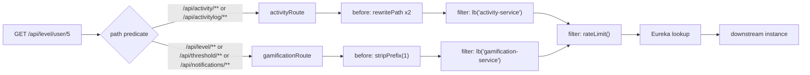

# API Gateway Routing — Java-DSL, Load-Balanced, Server MVC

**Service:** `api-gateway` · **Key class:** `RouteConfiguration`

## What it is / why it's notable

A real reverse-proxy gateway — not a set of hand-written pass-through controllers, and not the
reactive Spring Cloud Gateway most tutorials use. This is **Spring Cloud Gateway Server MVC**, the
servlet-based variant, chosen specifically so the gateway can share one Spring Security filter
chain with the JWT auth logic instead of running two different security stacks. Routes resolve
downstream services by name via Eureka + Spring Cloud LoadBalancer (`lb://activity-service`), so
service instances can scale or move without the gateway's config changing. The routes also used to
live in declarative YAML — they were **deliberately migrated to Java DSL** for a concrete technical
reason (below), and the old YAML is kept as a commented-out fossil rather than deleted, documenting
the "why" for the next person who wonders why routing isn't declarative anymore.

## How it works



### The two routes — `RouteConfiguration`

```java
@Bean
public RouterFunction<ServerResponse> activityRoute(RateLimitProperties props) {
    var b = props.activity();
    return route("activity").route(path("/api/activity/**").or(path("/api/activitylog/**")), http())
            .before(rewritePath("^/api/(activity|activitylog)/?$", "/$1/"))
            .before(rewritePath("^/api/(.*)$", "/$1"))
            .filter(lb("activity-service"))
            .filter(rateLimit(c -> c.setCapacity(b.capacity())
                    .setPeriod(Duration.ofSeconds(b.periodSeconds()))
                    .setKeyResolver(RateLimitKeyResolver.byUserIdOrIp())))
            .build();
}

@Bean
public RouterFunction<ServerResponse> gamificationRoute(RateLimitProperties props) {
    var b = props.gamification();
    return route("gamification")
            .route(path("/api/level/**").or(path("/api/threshold/**")).or(path("/api/notifications/**")), http())
            .before(stripPrefix(1))
            .filter(lb("gamification-service"))
            .filter(rateLimit(c -> c.setCapacity(b.capacity())
                    .setPeriod(Duration.ofSeconds(b.periodSeconds()))
                    .setKeyResolver(RateLimitKeyResolver.byUserIdOrIp())))
            .build();
}
```

**Two different path-rewrite strategies, and a reason for the difference.** The gamification route
uses a plain `stripPrefix(1)` (`/api/level/x` → `/level/x`). The activity route needs two
mutually-exclusive `rewritePath` regexes instead, because activity-service's list/create endpoints
are mapped at a bare `/` (e.g. `/activity/`), and Spring 6's `PathPatternParser` no longer treats
`/activity` and `/activity/` as equivalent — a plain `stripPrefix` would 404 on the base path.

**Why Java DSL instead of YAML.** The commented-out block still sitting in `application.yaml`
explains it in-place:
```yaml
# Routes moved to Java DSL (config/RouteConfiguration.java) so the Bucket4j rateLimit()
# filter can be attached (its key resolver is Java-DSL-only). Keeping these declarative
# YAML routes here as well would register duplicate routes for the same paths and shadow
# the rate-limited DSL ones — so they are commented out, not deleted (repo convention).
```
See [Rate Limiting](rate-limiting.md) for why the key resolver is DSL-only.

### What used to be here

An earlier design used Feign-based proxy controllers (`ActivityClient`/`GamificationClient` +
hand-written pass-through endpoints) instead of a real gateway. That code is archived under
`bkp/api-gateway-thining-1107/` — worth pointing to when explaining the "before" in a portfolio
walkthrough, since the contrast (proxy controllers vs. declarative routing) is a clean before/after
architecture story.

## Config

No routing config lives in `application.yaml` anymore (the YAML block is disabled). Everything is in
`RouteConfiguration.java`. Eureka resolution: `eureka.client.service-url.defaultZone` (see
[Observability & Discovery](observability-and-discovery.md)).

## Try it

```bash
curl http://localhost:8080/api/activity -H "Authorization: Bearer $TOKEN"       # -> activity-service
curl http://localhost:8080/api/level -H "Authorization: Bearer $TOKEN"          # -> gamification-service
```
Both routes are reverse-proxied byte-for-byte — a downstream `404`'s `ProblemDetail` body, including
its `instance` field showing the *downstream* path, passes through unchanged (see
[`API.md` § Error Response Format](../../API.md#error-response-format)).

## Related
[Rate Limiting](rate-limiting.md) · [Authentication & Identity Propagation](authentication-and-identity.md) ·
[Observability & Discovery](observability-and-discovery.md) · [`api-gateway/README.md`](../../api-gateway/README.md)
