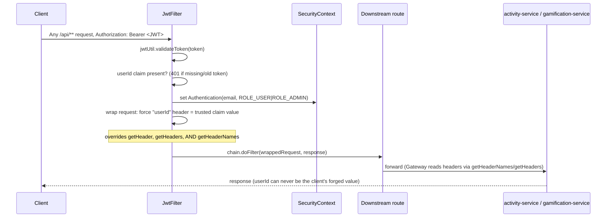

# Authentication & Trusted-Identity Propagation

**Service:** `api-gateway` · **Key classes:** `JwtUtil`, `AuthService`, `JwtFilter`, `SecurityConfig`

## What it is / why it's notable

Most tutorials stop at "validate the JWT." This system does the harder, less-blogged-about half:
once the gateway knows *who* the caller is, it has to get that identity to two downstream services
that have **no security of their own** — safely, in a way a malicious client can't spoof. That's
the actual IDOR (Insecure Direct Object Reference) fix at the heart of this feature: not just "add
a JWT filter," but closing the specific hole where overriding only `getHeader()` on a request
wrapper still let a forged `userId` header sail through, because Spring Cloud Gateway's request
forwarding reads headers via `getHeaderNames()`/`getHeaders()`, never `getHeader()` alone. Getting
this right — and documenting *why* it was wrong before — is the interesting part.

## How it works



### 1. Issuing the token — `JwtUtil` + `AuthService`

`JwtUtil.generateToken` signs an HS256 token whose claims carry both the caller's `role` **and**
their numeric `userId` (the `User.id` primary key) — not just the email subject most tutorials stop
at:

```java
public String generateToken(String email, Role role, Long userId) {
    return Jwts.builder()
            .setSubject(email)
            .claim("role", role.name())
            .claim("userId", userId)
            .setIssuedAt(new Date())
            .setExpiration(new Date(System.currentTimeMillis() + expiration))
            .signWith(SignatureAlgorithm.HS256, SECRET)
            .compact();
}
```
`AuthService.register`/`login` (`api-gateway/src/main/java/com/tracker/gateway/auth/AuthService.java`)
BCrypt-hashes passwords (`passwordEncoder.encode`) and, on login, compares with
`passwordEncoder.matches` — a failed lookup and a wrong password both throw the same
`InvalidCredentialsException`, so the API never reveals whether an email exists (no user
enumeration).

### 2. Validating + propagating — `JwtFilter` (the core fix)

`JwtFilter` (`api-gateway/src/main/java/com/tracker/gateway/security/JwtFilter.java`) is a plain
`OncePerRequestFilter`. Two details make it more than boilerplate:

**A missing `userId` claim is rejected outright**, not silently ignored — this protects against a
token minted before the claim existed from slipping through with no trusted identity:
```java
Long userId = claims.get("userId", Long.class);
if (userId == null) {
    response.setStatus(HttpServletResponse.SC_UNAUTHORIZED);
    return;
}
```

**The triple header override.** The file keeps the *old, insufficient* version as a comment right
next to the fix, which is worth reading as a piece of documentation in itself:
```java
// IDOR fix: the previous wrapper only overrode getHeader(String), but the
// Gateway's request forwarding enumerates headers via getHeaderNames()/
// getHeaders(String) to build the downstream request — getHeader() alone is
// never consulted there. That meant a client-forged "userId" header passed
// straight through unmodified, and a request with no "userId" header at all
// never got one added. Overriding all three closes both holes...
final String trustedUserId = userId.toString();
requestWrapper = new HttpServletRequestWrapper(request) {
    @Override
    public String getHeader(String name) {
        if (USER_ID_HEADER.equalsIgnoreCase(name)) return trustedUserId;
        return super.getHeader(name);
    }
    @Override
    public Enumeration<String> getHeaders(String name) {
        if (USER_ID_HEADER.equalsIgnoreCase(name)) return Collections.enumeration(List.of(trustedUserId));
        return super.getHeaders(name);
    }
    @Override
    public Enumeration<String> getHeaderNames() {
        List<String> names = Collections.list(super.getHeaderNames());
        names.removeIf(n -> USER_ID_HEADER.equalsIgnoreCase(n));
        names.add(USER_ID_HEADER);
        return Collections.enumeration(names);
    }
};
```
This is *why* the fix works where a naive `HttpServletRequestWrapper` subclass wouldn't: it closes
every enumeration path a caller might use to read the header, not just the obvious one.

### 3. Authorization — `SecurityConfig`

```java
http.csrf(csrf -> csrf.disable())
        .authorizeHttpRequests(auth -> auth
                .requestMatchers("/auth/**", "/swagger-ui.html", "/swagger-ui/**",
                        "/v3/api-docs", "/v3/api-docs/**", "/swagger-resources/**", "/actuator/**")
                .permitAll()
                .requestMatchers(HttpMethod.POST, "/api/activity", "/api/activity/").hasRole("ADMIN")
                .anyRequest().authenticated())
        .addFilterBefore(jwtFilter, UsernamePasswordAuthenticationFilter.class);
```
Role gating happens at the **URL level**, not `@PreAuthorize` — because routing is declarative
(see [API Gateway Routing](api-gateway-routing.md)), there's no controller method left to annotate.

## Downstream trust model

`activity-service` and `gamification-service` have zero security dependencies. Their controllers
read `@RequestHeader("userId") Long userId` and trust it completely — because by the time a request
reaches them, `JwtFilter` has already guaranteed that header can only carry the authenticated
caller's real id. Hitting those services directly (bypassing the gateway) is the one way to defeat
this — documented as a known caveat in `API.md`, not a gap in the fix itself.

## Config

`api-gateway/src/main/resources/application.yaml`:
```yaml
jwt:
  secret: ${JWT_SECRET:...}      # HS256 signing key
  expiration: ${JWT_EXPIRATION:86400000}   # 24h in ms
```

## Try it

```bash
# Register — returns a raw JWT (not JSON-wrapped)
TOKEN=$(curl -s -X POST http://localhost:8080/auth/register \
  -H "Content-Type: application/json" \
  -d '{"firstName":"Ada","lastName":"L","email":"ada@example.com","password":"secret"}')

# Spoofed-header test: authenticated as Ada, but forge a userId header for another user
curl -X POST http://localhost:8080/api/level -H "Authorization: Bearer $TOKEN" \
  -H "userId: 999" -H "Content-Type: application/json" \
  -d '{"activityId":1,"xp":5}'
# -> XP still lands on Ada's real id, never 999
```
The Postman collection's **Security – IDOR Verification** folder automates exactly this test.

## Related
[Rate Limiting](rate-limiting.md) (keys on this same trusted `userId` header) ·
[API Gateway Routing](api-gateway-routing.md) ·
[`API.md` § Authentication](../../API.md#authentication) ·
[`api-gateway/README.md` § Security model](../../api-gateway/README.md#security-model-the-centerpiece)
