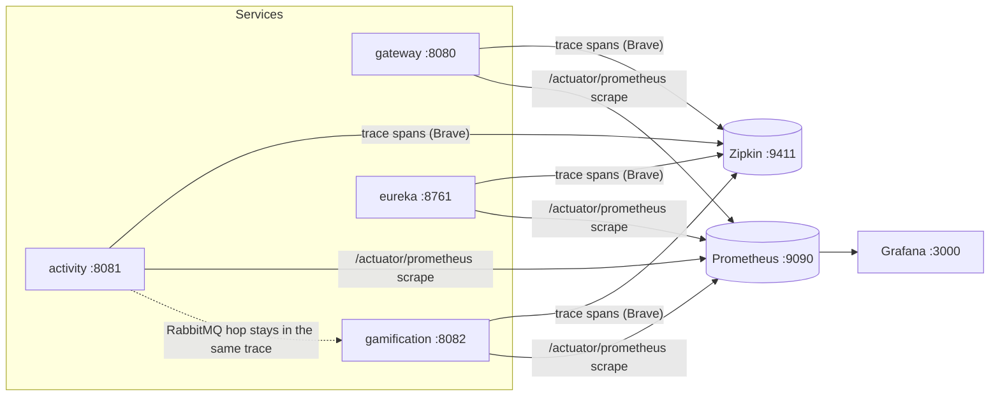

# Distributed Tracing & Metrics — Zipkin, Prometheus, Grafana

**Services:** all four · **Infra:** Zipkin, Prometheus, Grafana (in `docker-compose.yml`) ·
**Key config:** `management.tracing`/`management.zipkin` in each `application.yaml`, `prometheus.yml`,
`grafana/provisioning/`

## What it is / why it's notable

Full-stack observability across a distributed system: one request can be followed end-to-end as a
single trace, every service's runtime metrics are scraped into a time-series database, and a
provisioned dashboard renders it all. The standout detail is that the tracing spans the **async
message-broker hop** — a `POST /api/activitylog` produces one Zipkin trace that stretches across the
gateway, activity-service, *through RabbitMQ*, and into the gamification-service consumer, even
though those last two are decoupled by a queue (see [Event-Driven Decoupling](event-driven-decoupling.md)).
That works with essentially zero tracing code: Micrometer Tracing + Brave auto-instrument both the
HTTP and AMQP hops, propagating trace context in the message headers automatically. The whole
observability stack is config + `docker-compose`, not application logic.

## How it fits together



### 1. The three dependencies — added to all four services

```xml
<dependency><groupId>io.micrometer</groupId><artifactId>micrometer-registry-prometheus</artifactId></dependency>
<dependency><groupId>io.micrometer</groupId><artifactId>micrometer-tracing-bridge-brave</artifactId></dependency>
<dependency><groupId>io.zipkin.reporter2</groupId><artifactId>zipkin-reporter-brave</artifactId></dependency>
```
`micrometer-registry-prometheus` exposes a scrape endpoint; the Brave bridge + Zipkin reporter emit
spans. Nothing else in the code changes — instrumentation is automatic.

### 2. Tracing + metrics config — identical shape in each `application.yaml`

```yaml
management:
  endpoints:
    web:
      exposure:
        include: health,info,prometheus,metrics       # /actuator/prometheus now exposed
  tracing:
    enabled: true
    sampling:
      probability: 1.0                                  # sample every request (dev)
  zipkin:
    tracing:
      endpoint: ${ZIPKIN_BASE_URL:http://localhost:9411}/api/v2/spans
  metrics:
    tags:
      application: ${spring.application.name}           # every metric tagged with its service
```

### 3. Correlation IDs in the logs

Each service's console log pattern carries the current `traceId`/`spanId` (pulled from the MDC), so a
log line can be matched back to its Zipkin trace:
```
... %clr([%X{traceId:-},%X{spanId:-}]){yellow} %clr(%-40.40logger{39}){cyan} : %m ...
```
Grep a `traceId` out of the logs, paste it into Zipkin, and see the whole request.

### 4. Metrics scraping — `prometheus.yml`

Prometheus scrapes each service's `/actuator/prometheus` on a 15s interval, plus RabbitMQ's own
metrics endpoint:
```yaml
scrape_configs:
  - job_name: 'api-gateway'
    metrics_path: '/actuator/prometheus'
    static_configs:
      - targets: [ 'host.docker.internal:8080' ]
        labels: { application: 'api-gateway' }
  # ... eureka-server:8761, activity-service:8081, gamification-service:8082 ...
  - job_name: 'rabbitmq'
    metrics_path: '/metrics'
    static_configs:
      - targets: [ 'host.docker.internal:15692' ]
```

### 5. Grafana — provisioned, not click-configured

Grafana comes up with its Prometheus datasource and a dashboard already wired, via provisioning files
mounted into the container — no manual setup on first boot:
```yaml
# grafana/provisioning/datasources/prometheus.yml
datasources:
  - name: prometheus
    type: prometheus
    url: http://prometheus:9090
    isDefault: true
```
plus `grafana/provisioning/dashboards/dashboard.yml` pointing at
`grafana/dashboards/gamified-tracker-dashboard.json`.

## Infrastructure — `docker-compose.yml`

| Service | Image | Port | Notes |
|---|---|---|---|
| `zipkin` | `openzipkin/zipkin` | 9411 | trace UI + collector, healthchecked |
| `prometheus` | `prom/prometheus` | 9090 | scrape config bind-mounted; waits on all app services healthy |
| `grafana` | `grafana/grafana` | 3000 | admin/admin, `grafana-data` volume, provisioning + dashboards mounted |

Prometheus `depends_on` every application service being `service_healthy` before it starts scraping
(the same healthcheck orchestration described in
[Observability & Discovery](observability-and-discovery.md)).

## The payoff — tracing the async hop

This is what makes the feature more than "we added Zipkin." Because Spring AMQP is auto-instrumented,
the trace context rides along in the RabbitMQ message headers, so the outbox relay's publish and the
consumer's receive land in the **same trace** as the originating HTTP request — the one part of the
system that's genuinely asynchronous still shows up as a continuous span tree. See
[Event-Driven Decoupling](event-driven-decoupling.md) for that hop's mechanics.

## Try it

```bash
docker-compose up --build
# fire a request, then follow it:
curl -X POST http://localhost:8080/api/activitylog -H "Authorization: Bearer $TOKEN" \
  -H "Content-Type: application/json" \
  -d '{"activityName":"Study","startTime":"2026-07-16T09:00:00","endTime":"2026-07-16T09:30:00"}'
```
- **Zipkin** — http://localhost:9411 → find the trace spanning gateway → activity → gamification
- **Prometheus** — http://localhost:9090 → *Status → Targets* shows every service `UP`
- **Grafana** — http://localhost:3000 (admin/admin) → the provisioned Gamified Tracker dashboard

## Related
[Event-Driven Decoupling](event-driven-decoupling.md) (the async hop the trace spans) ·
[Observability & Discovery](observability-and-discovery.md) (health checks + the compose
orchestration this builds on)
