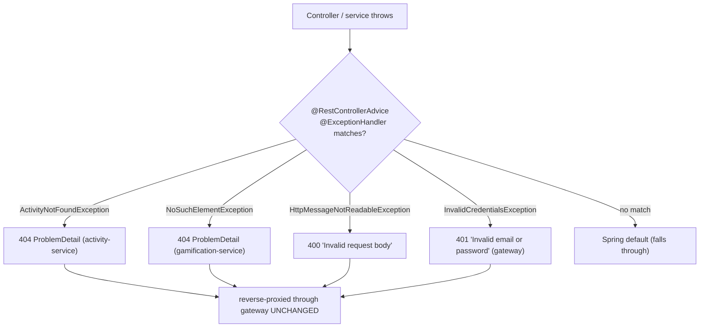

# Error Handling — RFC 7807 ProblemDetail, Consistently

**Services:** all three web services · **Key classes:** `GatewayExceptionHandler`,
`GlobalExceptionHandler` (activity + gamification), `InvalidCredentialsException`,
`ActivityNotFoundException`

## What it is / why it's notable

Every service returns errors in one machine-readable, standardized shape — Spring's `ProblemDetail`
(the RFC 7807 `application/problem+json` model) — instead of Spring's default whitelabel error page
or ad-hoc JSON that drifts per endpoint. That consistency is the point: a client parses one error
format everywhere. Two design touches raise it above "we added an exception handler": the login
error is deliberately identical for unknown-email and wrong-password (no user enumeration), and
because the gateway is a real reverse proxy, a downstream service's `ProblemDetail` reaches the
client **byte-for-byte unchanged** — the gateway doesn't re-wrap or flatten it, so the error a
client sees is the error the owning service actually produced.

## How it works



### Each service advises on the exceptions it actually throws

**Gateway — one handler, and a security-conscious message:**
```java
@RestControllerAdvice
public class GatewayExceptionHandler {
    @ExceptionHandler(InvalidCredentialsException.class)
    public ProblemDetail handleInvalidCredentials(InvalidCredentialsException ex) {
        return ProblemDetail.forStatusAndDetail(HttpStatus.UNAUTHORIZED, ex.getMessage());
    }
}
```
The exception itself hardcodes one message for both failure modes:
```java
public class InvalidCredentialsException extends RuntimeException {
    public InvalidCredentialsException() { super("Invalid email or password"); }
}
```
`AuthService.login` throws it whether the email doesn't exist *or* the password is wrong (see
[Authentication & Identity Propagation](authentication-and-identity.md)) — so the response never
reveals which accounts exist. This is a small thing that's easy to get wrong by returning "user not
found" vs "bad password."

**activity-service — domain 404s:**
```java
@RestControllerAdvice
public class GlobalExceptionHandler {
    @ExceptionHandler(ActivityNotFoundException.class)
    public ProblemDetail handleNotFound(ActivityNotFoundException ex) {
        return ProblemDetail.forStatusAndDetail(HttpStatus.NOT_FOUND, ex.getMessage());
    }
}
```
`ActivityNotFoundException` carries a specific message (`"Activity not found: {name}"` /
`"Activity log not found: {id}"`) thrown from every lookup path.

**gamification-service — 404 + a validation 400:**
```java
@RestControllerAdvice
public class GlobalExceptionHandler {
    @ExceptionHandler(NoSuchElementException.class)
    public ProblemDetail handleNotFound(NoSuchElementException ex) {
        return ProblemDetail.forStatusAndDetail(HttpStatus.NOT_FOUND, ex.getMessage());
    }
    @ExceptionHandler(HttpMessageNotReadableException.class)
    public ProblemDetail handleInvalidRequestBody(HttpMessageNotReadableException ex) {
        return ProblemDetail.forStatusAndDetail(HttpStatus.BAD_REQUEST, "Invalid request body");
    }
}
```
The `400` path is subtle: `LevelTrackerRequestDTO`'s compact constructor throws on `xp < 0` **during
JSON deserialization**, which Spring surfaces as `HttpMessageNotReadableException` — so a negative-XP
body is rejected with a clean `400` before it ever reaches the service, rather than blowing up as an
unhandled `500`.

### The response shape

```json
{
  "type": "about:blank",
  "status": 404,
  "detail": "Activity not found: Study",
  "instance": "/activity/Study"
}
```

### Pass-through through the gateway

Because routing is a genuine reverse proxy (see [API Gateway Routing](api-gateway-routing.md)), the
`instance` field of a downstream error still shows the *downstream* service's own path (e.g.
`/level/999999`), not the gateway's `/api/level/999999` — proof the gateway forwards the response
untouched rather than re-serializing it. `GET /api/activity/does-not-exist` and
`GET /api/level/999999` each return the exact body their owning service produces directly.

## Known edges (honest inventory)

- Only the exceptions above are advised; anything else falls through to Spring's defaults — there's
  no catch-all `@ExceptionHandler(Exception.class)`.
- There's no Bean Validation layer (`jakarta.validation`/`@Valid`) yet, so most input checks are the
  ad-hoc compact-constructor kind shown above rather than declarative field constraints (a known
  backlog item).

## Try it

```bash
curl -i http://localhost:8080/api/activity/DoesNotExist -H "Authorization: Bearer $TOKEN"   # 404 ProblemDetail
curl -i -X POST http://localhost:8080/auth/login -H "Content-Type: application/json" \
  -d '{"email":"nobody@example.com","password":"x"}'                                         # 401 "Invalid email or password"
curl -i -X POST http://localhost:8080/api/level -H "Authorization: Bearer $TOKEN" \
  -H "Content-Type: application/json" -d '{"activityId":1,"xp":-5}'                           # 400 "Invalid request body"
```

## Related
[Authentication & Identity Propagation](authentication-and-identity.md) (the no-enumeration login) ·
[API Gateway Routing](api-gateway-routing.md) (byte-for-byte pass-through) ·
[`API.md` § Error Response Format](../../API.md#error-response-format)
