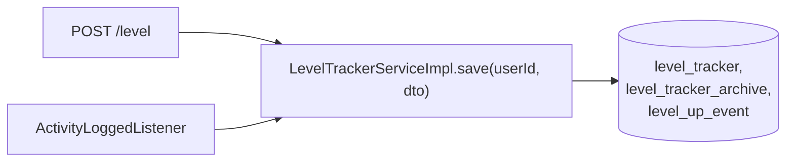

# Event-Driven Decoupling — Transactional Outbox + Idempotent Consumer + DLQ

**Services:** `activity-service` (producer) + `gamification-service` (consumer) · **Key classes:**
`ActivityLogServiceImpl`, `OutboxEvent`/`OutboxEventRepository`/`OutboxRelay`,
`ActivityLoggedListener`, `ProcessedEvent`/`ProcessedEventRepository`, `RabbitConfig` (both sides)

## What it is / why it's notable

This is the headline architecture feature — three textbook distributed-systems patterns
(Transactional Outbox, Polling Publisher, Idempotent Consumer) implemented together to solve a real
bug, not as an academic exercise. Originally, `activity-service` called `gamification-service`
**synchronously** to award XP, and that call ran *before* the activity log was even saved — so a
gamification outage silently lost the user's log entirely. The fix isn't "add a retry" — it's
removing the synchronous dependency altogether: the write and the "this happened" event are
persisted atomically in one local transaction, a background relay ships the event to RabbitMQ
whenever it can, and the consumer applies the XP idempotently, safe against redelivery. `POST
/api/activitylog` now returns immediately and can never be blocked or broken by the other service
being down.

## How it works — end to end

```mermaid
sequenceDiagram
    participant C as Client
    participant AS as ActivityLogServiceImpl
    participant DB1 as activity-service DB
    participant OR as OutboxRelay (scheduled)
    participant MQ as RabbitMQ
    participant AL as ActivityLoggedListener
    participant DB2 as gamification-service DB

    C->>AS: POST /api/activitylog
    Note over AS,DB1: single @Transactional method
    AS->>AS: compute duration, xpEarned, bonus roll
    AS->>DB1: INSERT activity_log (get generated logId)
    AS->>DB1: INSERT outbox_event (payload, published_at=NULL)
    AS-->>C: 200 { bonusApplied/bonusMultiplier real; leveledUp: false }

    loop every outbox.relay.delay-ms (2000ms)
        OR->>DB1: SELECT top 100 WHERE published_at IS NULL ORDER BY created_at
        OR->>MQ: convertAndSend(exchange, routingKey, event)
        alt send succeeded
            OR->>DB1: UPDATE published_at = now()
        else send failed
            Note over OR: leave published_at NULL, retry next tick
        end
    end

    MQ->>AL: deliver ActivityLoggedEvent
    Note over AL,DB2: single @Transactional method
    AL->>DB2: existsById(logId) in processed_event?
    alt already processed
        AL-->>MQ: ack (no-op)
    else new
        AL->>DB2: INSERT processed_event(logId)  -- guard, written FIRST
        AL->>DB2: LevelTrackerServiceImpl.save(userId, dto)
        AL-->>MQ: ack
    end

    C->>AS: (later) GET /api/level/user/{id}
    AS-->>C: real leveledUp / level / totalXp
```

### 1. Producer — save-then-outbox in one transaction (the actual bug fix)

```java
@Override
@Transactional
public ResponseEntity<ActivityLogResponse> addActivityLogResponseResponseEntity(
        Long userId, ActivityLogRequest activityLogRequest) {
    // ... compute duration, effectiveXpMultiplier, bonus roll, xpEarned ...

    var saved = activityLogRepository.save(activityLog);              // 1. log FIRST

    var event = new ActivityLoggedEvent(saved.getId(), userId, saved.getActivity().getId(), saved.getXpEarned());
    outboxEventRepository.save(OutboxEvent.builder()                  // 2. outbox row, SAME tx
            .aggregateType("ActivityLog").aggregateId(saved.getId()).eventType("ActivityLogged")
            .payload(toJson(event)).idempotencyKey(String.valueOf(saved.getId()))
            .createdAt(LocalDateTime.now()).publishedAt(null).build());

    boolean bonusApplied = bonus != 1.0;
    return ResponseEntity.ok(mapToActivityLogResponse(saved, bonusApplied, bonus, false)); // leveledUp always false
}
```
`@Transactional` is the whole trick: either both rows commit, or neither does. There is no window
where a log exists with no corresponding event, and no synchronous call to another service that can
fail this request. Note the trade-off in the last line — `leveledUp` is now always `false` here,
because nothing downstream has run yet.

### 2. Polling publisher — `OutboxRelay`

```java
@Scheduled(fixedDelayString = "${outbox.relay.delay-ms:2000}")
@Transactional
public void publishPending() {
    var batch = repository.findTop100ByPublishedAtIsNullOrderByCreatedAtAsc();
    for (var row : batch) {
        try {
            var event = objectMapper.readValue(row.getPayload(), ActivityLoggedEvent.class);
            rabbitTemplate.convertAndSend(exchange, routingKey, event);
            row.setPublishedAt(LocalDateTime.now());   // stamped only on success
        } catch (Exception e) {
            log.warn("Failed to publish outbox row {} (will retry)", row.getId(), e);
        }
    }
}
```
`publishedAt IS NULL` **is** the queue — no separate pending-message table. A send failure is caught
per-row so one bad message never blocks the batch, and it's simply retried on the next 2-second
tick. This makes delivery **at-least-once**, which is exactly why the consumer has to be idempotent.

### 3. Idempotent consumer — dedup-before-apply, not dedup-after

```java
@RabbitListener(queues = "${messaging.queue}")
@Transactional
public void onActivityLogged(ActivityLoggedEvent event) {
    String key = String.valueOf(event.logId());

    if (processedEventRepository.existsById(key)) {          // fast path for redelivery
        return;
    }

    processedEventRepository.save(new ProcessedEvent(key, LocalDateTime.now()));  // guard FIRST

    levelTrackerService.save(event.userId(),
            new LevelTrackerRequestDTO(event.activityId(), event.xpEarned()));
}
```
The subtle part: `processed_event.idempotency_key` is a **unique primary key**, and the guard row is
saved **before** XP is applied — not after. If two deliveries of the same event race each other, the
second `save()` throws a constraint violation, which rolls back the *entire* transaction (including
any XP that would have been applied), the message gets redelivered, and this time `existsById` is
already `true`. XP is applied **exactly once** despite at-least-once delivery — and it calls the
**same** `LevelTrackerServiceImpl.save(userId, dto)` the HTTP `POST /level` endpoint uses (see
[Concurrency-Safe XP Accumulation](concurrency-safe-xp.md)), so there's no business-logic fork
between the sync and async paths.

### 4. Dead-letter queue + a cross-service Jackson gotcha — `RabbitConfig` (gamification side)

```java
Queue activityLoggedQueue = QueueBuilder.durable(queue)
        .withArgument("x-dead-letter-exchange", dlx)
        .withArgument("x-dead-letter-routing-key", dlqKey)
        .build();
```
Combined with `spring.rabbitmq.listener.simple.retry` (3 attempts) and
`default-requeue-rejected: false`, a message that keeps failing is retried locally 3 times, then
routed to a DLQ instead of looping forever.

A second, easy-to-miss gotcha the config solves: the producer's `Jackson2JsonMessageConverter`
stamps a `__TypeId__` header with its **own** fully-qualified class name
(`com.tracker.activity.messaging.ActivityLoggedEvent`), which doesn't exist in gamification-service's
classpath. The consumer's converter sets `TypePrecedence.INFERRED`, telling it to ignore that header
and deserialize into whatever type the `@RabbitListener` method parameter declares instead — a
structurally identical, separately-defined record on the other side. Without this, every message
would fail deserialization with a `ClassNotFoundException`.

## Two callers, one method


The HTTP endpoint and the RabbitMQ consumer both converge on the identical save path — the consumer
just calls it in-process with `userId` from the event payload instead of a request header.

## The response-shape trade-off

| Field | `POST /api/activitylog` | `GET /api/level/user/{id}` (after async apply) |
|---|---|---|
| `bonusApplied` / `bonusMultiplier` | **real** — computed locally, before any messaging | n/a |
| `leveledUp` | **always `false`** | real — reflects the row's actual state |

A client can no longer learn "did I level up?" synchronously — it checks back via
`GET /api/level/user/{id}` or the [level-up notification feed](level-up-notifications.md).

## Config

```yaml
# both services
spring.rabbitmq: { host: ${SPRING_RABBITMQ_HOST:rabbitmq}, port: 5672, username: guest, password: guest }
messaging: { exchange: activity.events, routing-key: activity.logged }

# activity-service only
outbox.relay.delay-ms: 2000

# gamification-service only
spring.rabbitmq.listener.simple: { retry: { enabled: true, max-attempts: 3, initial-interval: 1000ms }, default-requeue-rejected: false }
messaging: { queue: gamification.activity-logged.q, dlx: activity.events.dlx, dlq: gamification.activity-logged.dlq }
```
`docker-compose.yml` runs `rabbitmq:3-management` (AMQP `5672`, management UI `15672`, guest/guest).

## Try it

```bash
docker-compose up --build          # mgmt UI: http://localhost:15672 (guest/guest)
curl -X POST http://localhost:8080/api/activitylog -H "Authorization: Bearer $TOKEN" \
  -H "Content-Type: application/json" \
  -d '{"activityName":"Study","startTime":"2026-07-16T09:00:00","endTime":"2026-07-16T09:30:00"}'
# -> 200 immediately, leveledUp:false

sleep 3   # outbox relay + consumer catch up
curl http://localhost:8080/api/level/user/1 -H "Authorization: Bearer $TOKEN"
# -> XP applied; leveledUp real if a threshold was crossed
```
Kill `gamification` mid-flow: `POST /api/activitylog` still returns `200` and the log is never lost —
messages queue in RabbitMQ and drain once the service comes back.

## Related
[Concurrency-Safe XP Accumulation](concurrency-safe-xp.md) (the method both callers converge on) ·
[Level-Up Notifications](level-up-notifications.md) (where the eventual `leveledUp` surfaces) ·
[`API.md`](../../API.md)
