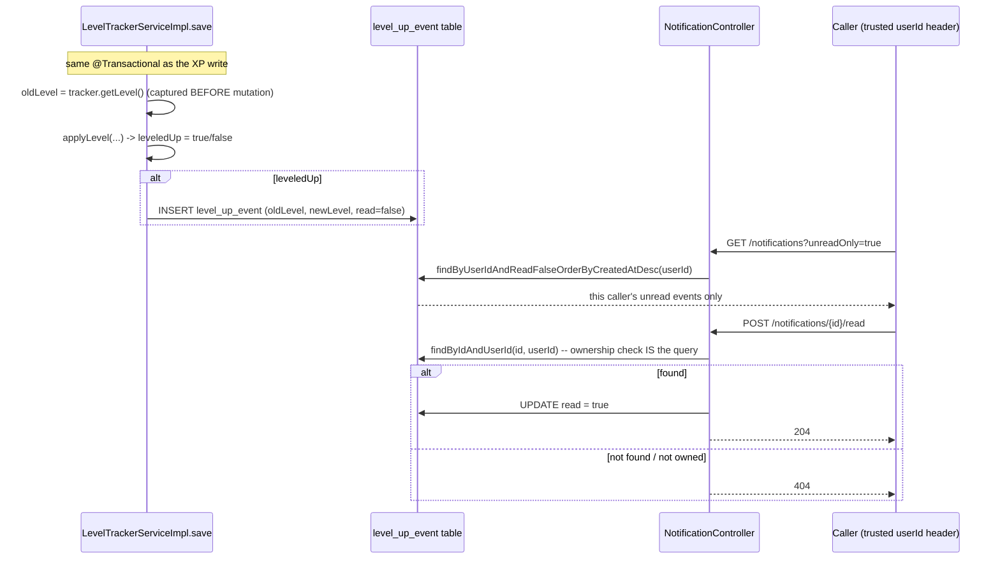

# Level-Up Notifications — Caller-Scoped In-App Feed

**Service:** `gamification-service` · **Key classes:** `LevelUpEvent`, `LevelUpEventRepository`,
`NotificationServiceImpl`, `NotificationController`

## What it is / why it's notable

The [leveling engine](leveling-engine.md) already knew when a user leveled up — it just threw that
information away after building the HTTP response. This feature persists it instead, turning a
transient boolean into a durable, queryable notification feed: list all / unread-only, get an unread
count, mark one read. The scoping is the part worth calling out: every read is keyed off the
same trusted `userId` header used everywhere else in the system (see
[Authentication & Identity Propagation](authentication-and-identity.md)), so a user's notifications
are structurally private — there's no `userId` path parameter to swap out, and `markRead` re-checks
ownership on every write via the query itself, not a separate authorization check.

## How it works



### 1. Emission — inside the same transaction as the XP write

```java
// LevelTrackerServiceImpl.save
Integer oldLevel = tracker.getLevel();               // captured BEFORE mutation
tracker.setTotalXp(tracker.getTotalXp() + dto.xp());
boolean leveledUp = applyLevel(tracker);
var saved = levelTrackerRepository.save(tracker);

if (leveledUp) {
    levelUpEventRepository.save(LevelUpEvent.builder()
            .userId(tracker.getUserId()).activityId(tracker.getActivityId())
            .oldLevel(oldLevel).newLevel(saved.getLevel())
            .currentLevelXp(saved.getCurrentLevelXp()).totalXp(saved.getTotalXp())
            .createdAt(LocalDateTime.now()).read(false).build());
}
```
Because this runs inside the same `@Transactional` method as the XP accumulation (see
[Concurrency-Safe XP Accumulation](concurrency-safe-xp.md)), a notification can never be created
for a level-up that didn't actually commit, and vice versa.

### 2. A deliberate JPA naming fix — `LevelUpEvent.read`

```java
// Field is named `read` (not `isRead`) so the JPA attribute resolves to `read`,
// matching LevelUpEventRepository's derived queries (…AndReadFalse…). Lombok still
// generates isRead()/setRead(); the DB column stays `is_read`.
@Column(name = "is_read")
@Builder.Default
private boolean read = false;
```
Worth calling out because it's the kind of bug that's invisible until it isn't, and this codebase hit
it for real: Hibernate's JPA metamodel derives the persistent attribute name straight from the Java
field name. With the "natural" Java boolean convention — a field literally named `isRead` — the
attribute becomes `isRead`, not `read`. Spring Data's `findByUserIdAndReadFalse...` derivation looks
for an attribute called `read`; against `isRead` it fails at application startup with a
`PropertyReferenceException`, before a single request is served. Naming the field `read` directly
makes the attribute name match what the derived queries expect, while `@Column(name = "is_read")`
keeps the SQL column name conventional.

### 3. Ownership-scoped reads — `LevelUpEventRepository`

```java
public interface LevelUpEventRepository extends JpaRepository<LevelUpEvent, Long> {
    List<LevelUpEvent> findByUserIdOrderByCreatedAtDesc(Long userId);
    List<LevelUpEvent> findByUserIdAndReadFalseOrderByCreatedAtDesc(Long userId);
    long countByUserIdAndReadFalse(Long userId);
    Optional<LevelUpEvent> findByIdAndUserId(Long id, Long userId);   // ownership check IS the query
}
```
`findByIdAndUserId` is the important one: `markRead` doesn't fetch by id and then separately check
`event.getUserId().equals(callerId)` — the ownership constraint is baked directly into the query, so
there's no way to accidentally skip it.

```java
// NotificationServiceImpl.markRead
@Transactional
public void markRead(Long userId, Long eventId) {
    var event = levelUpEventRepository.findByIdAndUserId(eventId, userId)
            .orElseThrow(() -> new NoSuchElementException("Notification " + eventId + " not found"));
    event.setRead(true);
    levelUpEventRepository.save(event);
}
```
A missing event and someone else's event produce the **identical** `404` — no information leak about
whether the id exists at all.

### 4. The API — `NotificationController`

```java
@GetMapping
public ResponseEntity<List<LevelUpEventDto>> findAllByUserId(@RequestHeader Long userId,
        @RequestParam(name = "unreadOnly", defaultValue = "false") boolean unreadOnly) { ... }

@GetMapping("/unread-count")
public ResponseEntity<Map<String, Long>> findAllByUserId(@RequestHeader Long userId) { ... }

@PostMapping("/{id}/read")
public ResponseEntity<Void> markRead(@RequestHeader("userId") Long userId, @PathVariable Long id) { ... }
```

## Config

No config keys — pure JPA/derived-query behavior. Routed through the gateway at
`/api/notifications/**` (see [API Gateway Routing](api-gateway-routing.md)).

## Try it

```bash
curl http://localhost:8080/api/notifications?unreadOnly=true -H "Authorization: Bearer $TOKEN"
curl http://localhost:8080/api/notifications/unread-count -H "Authorization: Bearer $TOKEN"
curl -X POST http://localhost:8080/api/notifications/1/read -H "Authorization: Bearer $TOKEN"
# -> 404 if event 1 doesn't exist OR belongs to a different user
```

## Related
[Concurrency-Safe XP Accumulation](concurrency-safe-xp.md) (same transaction as emission) ·
[Leveling Engine](leveling-engine.md) (source of the `leveledUp` signal) ·
[Authentication & Identity Propagation](authentication-and-identity.md) (the trusted `userId` scoping)
