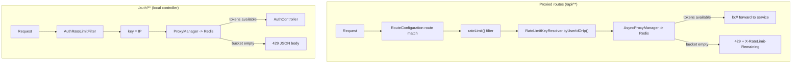

# Rate Limiting — Redis-Backed Bucket4j

**Service:** `api-gateway` · **Key classes:** `RateLimitConfig`, `RateLimitKeyResolver`,
`RouteConfiguration`, `AuthRateLimitFilter`

## What it is / why it's notable

Distributed token-bucket rate limiting, shared across gateway replicas via Redis — not an
in-memory counter that resets per instance. The interesting engineering decision here is that this
project runs the **Server MVC** flavor of Spring Cloud Gateway (servlet-based), which does *not*
have the reactive gateway's familiar `RequestRateLimiter`/`RedisRateLimiter` filter. Instead it uses
Bucket4j's own gateway integration — a distinct API most examples online don't cover. On top of
that, there are genuinely **two separate throttles** wired for two different reasons, not one
filter reused everywhere.

## How it works

Two independent paths, both backed by the same Redis-held bucket state:



**Why two throttles, not one:** `/auth/register` and `/auth/login` are handled by a *local*
controller inside the gateway — they were never turned into `RouterFunction` routes, so the
Gateway's `rateLimit()` filter has nothing to attach to. `AuthRateLimitFilter` fills that gap as a
plain servlet filter, keyed by IP instead of `userId` (there's no authenticated caller yet on a
login attempt).

### 1. The Bucket4j + Redis plumbing — `RateLimitConfig`

```java
@Bean(destroyMethod = "close")
public RedisClient bucket4jRedisClient(@Value("${spring.data.redis.host}") String host,
                                       @Value("${spring.data.redis.port}") int port) {
    return RedisClient.create(RedisURI.create(host, port));
}

@Bean(destroyMethod = "close")
public StatefulRedisConnection<String, byte[]> bucket4jRedisConnection(RedisClient redisClient) {
    return redisClient.connect(RedisCodec.of(StringCodec.UTF8, ByteArrayCodec.INSTANCE));
}

@Bean
public AsyncProxyManager<String> asyncProxyManager(StatefulRedisConnection<String, byte[]> conn) {
    return Bucket4jLettuce.casBasedBuilder(conn)
            .expirationAfterWrite(ExpirationAfterWriteStrategy.basedOnTimeForRefillingBucketUpToMax(Duration.ofMinutes(2)))
            .build().asAsync();
}
```
Two `ProxyManager` flavors come out of the same Redis connection: an **async** one for the
route filter (matches the MVC gateway's filter contract) and a **synchronous** one for
`AuthRateLimitFilter` (a plain filter has no async hook). `expirationAfterWrite` lets Redis garbage
collect idle bucket keys instead of accumulating one per user forever.

### 2. Who gets throttled — `RateLimitKeyResolver`

```java
public static Function<ServerRequest, String> byUserIdOrIp() {
    return serverRequest -> {
        String userId = serverRequest.servletRequest().getHeader("userId");
        if (userId != null && !userId.isBlank()) return "user:" + userId;
        String xff = serverRequest.servletRequest().getHeader("X-Forwarded-For");
        String ip = (xff != null && !xff.isBlank()) ? xff.split(",")[0].trim() : serverRequest.servletRequest().getRemoteAddr();
        return "ip:" + ip;
    };
}
```
Keys on the **trusted** `userId` header (see [Authentication & Identity Propagation](authentication-and-identity.md))
so one user hitting their limit never throttles anyone else — and because that header is
JWT-derived, not client-suppliable, the key can't be spoofed to dodge the limit either.

### 3. Attaching it to routes — `RouteConfiguration`

```java
route("activity").route(path("/api/activity/**").or(path("/api/activitylog/**")), http())
    .before(rewritePath("^/api/(activity|activitylog)/?$", "/$1/"))
    .before(rewritePath("^/api/(.*)$", "/$1"))
    .filter(lb("activity-service"))
    .filter(rateLimit(c -> c
            .setCapacity(b.capacity())
            .setPeriod(Duration.ofSeconds(b.periodSeconds()))
            .setKeyResolver(RateLimitKeyResolver.byUserIdOrIp())));
```
The `rateLimit()` filter's key resolver is **Java-DSL only** — it can't be expressed in YAML — which
is one reason routing itself lives in Java DSL rather than declarative `application.yaml` (see
[API Gateway Routing](api-gateway-routing.md)).

### 4. The IP-only guard — `AuthRateLimitFilter`

```java
@Component
@Order(2)
public class AuthRateLimitFilter extends OncePerRequestFilter {
    @Override
    protected boolean shouldNotFilter(HttpServletRequest request) {
        return !request.getRequestURI().startsWith("/auth");
    }

    @Override
    protected void doFilterInternal(HttpServletRequest request, HttpServletResponse response, FilterChain chain) {
        String ip = request.getRemoteAddr();
        var bucket = proxyManager.builder().build("auth" + ip, () -> configuration);
        if (bucket.tryConsume(1)) {
            chain.doFilter(request, response);
        } else {
            response.setStatus(429);
            response.getWriter().write("{\"error\":\"Too many requests\"}");
        }
    }
}
```

## Config

```yaml
spring:
  data:
    redis:
      host: ${SPRING_DATA_REDIS_HOST:redis}
      port: ${SPRING_DATA_REDIS_PORT:6379}

rate-limit:
  activity:       { capacity: ${RL_ACTIVITY_CAPACITY:100}, period-seconds: ${RL_ACTIVITY_PERIOD:60} }
  gamification:   { capacity: ${RL_GAMIFICATION_CAPACITY:100}, period-seconds: ${RL_GAMIFICATION_PERIOD:60} }
  auth:           { capacity: ${RL_AUTH_CAPACITY:10}, period-seconds: ${RL_AUTH_PERIOD:60} }
```
`docker-compose.yml` runs `redis:7-alpine` with a healthcheck; the gateway's startup waits on
`redis: condition: service_healthy`.

## Try it

```bash
TOKEN=...   # from POST /auth/register
for i in $(seq 1 130); do
  curl -s -o /dev/null -w "%{http_code}\n" http://localhost:8080/api/level \
    -H "Authorization: Bearer $TOKEN"
done | sort | uniq -c        # ~100 x 200, then 429
```
The Postman collection has a **Rate Limiting** folder that self-loops one request via
`postman.setNextRequest` until it trips the `429` (Collection Runner only).

## Related
[Authentication & Identity Propagation](authentication-and-identity.md) (supplies the trusted key) ·
[API Gateway Routing](api-gateway-routing.md) (where the filter attaches) ·
[`api-gateway/README.md` § Rate limiting](../../api-gateway/README.md#rate-limiting)
